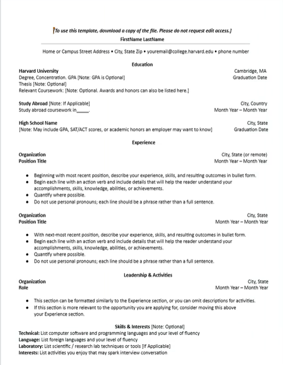
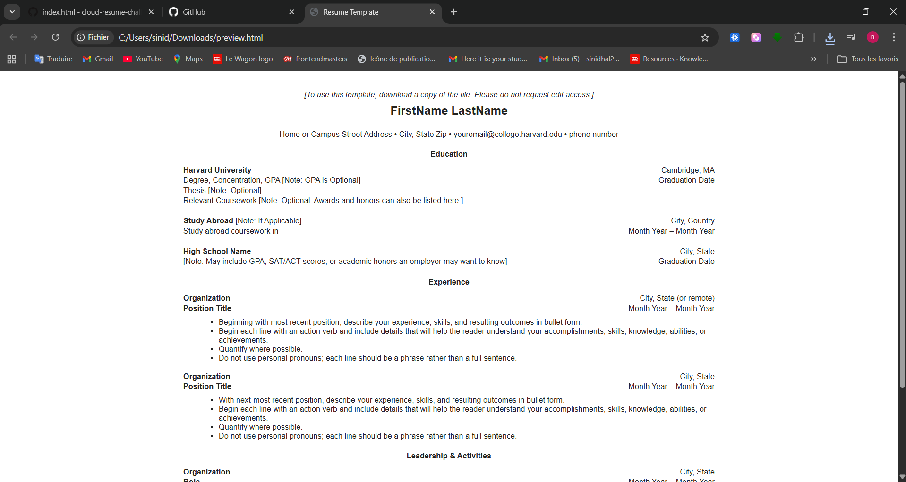

# cloud resume project 

## Frontend Technical Specification
- Create a static website that serves an html resume.
 ## Resume Formart Consideration 
 I'm going to use the Harvard Resume Template format as the basis of my resume.
 ## Harvard Resume Format Generation 
 I know how HTML very well, so I'm going to let GenAi to do the heavy lifting and generate out html HTML and possibly CSS and from there I will manually refactor the code to preferred standard.
 
 Prompt to ChatPT 5:

 '''text 
 converst this resume format onto html. please dont use a css framewrok. please use the least amount of css tags 
Image provided for LLM
 

 This is [generated output](./docs/resume-minimal.html) which I will refactor.

 This is what the generated HTML looks like unaltered:
 

 ## HTML adjustments 
 
 - UTF8 will support most langueges, I plan to use English and German so we'll leave this meta tag in. 
 - Because we will be applying mobile styling to our website I'll include the view meta width=device-width so mobile styling scales normally. 
 - We'll extract our styles into its own stylesheet after we are happy with our HTML markup
 - We'll simplfy our HTML markup css selector to be minimal as possible
 - for the html page I'll use soft tabs two spaces because I'm ruby and ruby on rails fan
  ## Serve Static website locally

 We Need to serve our static website locally so we can start using stylesheets
 externally form our HTML page in a cloud Developer Enviroment (CDE)
Assuming node installed

```sh
npm i http-server -g
```
https://www.npmjs.com/package/http-server 

### Server Website

http-server will server a public folder by default where the command is run. 

```sh
cd frontend
http-server
```

## Image Size Considerations 
Ihavr backgroud texture that was 2.8 MB.
I'm going to optimize it to webp an online tool.